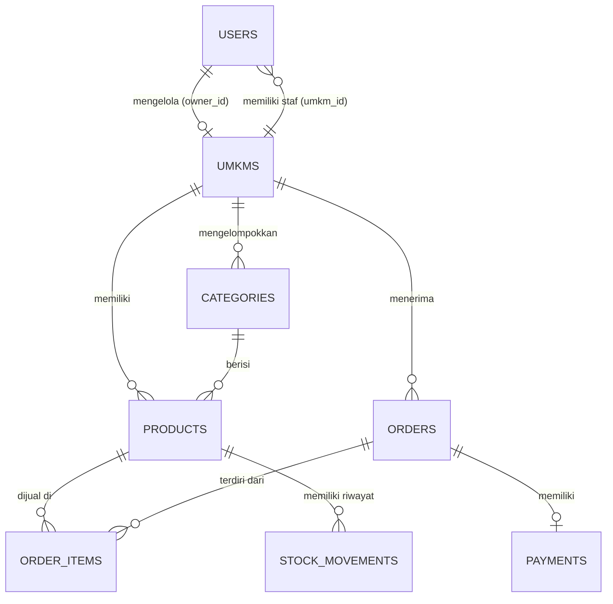

# Panduan Pitching & Bedah Kode (Sistem Manajemen UMKM Terpadu)

Dokumen ini adalah naskah presentasi teknis sekaligus referensi lengkap struktur data, relasi, dan logika program untuk memudahkan Anda menjelaskan aplikasi ini kepada pihak ketiga (klien, penguji, atau investor).

---

## 🌟 BAGIAN 1: PENGANTAR & VALUE PROPOSITION
> **Naskah Anda:**
> *"Selamat pagi/siang rekan-rekan sekalian. Hari ini saya akan mempresentasikan **Sistem Manajemen UMKM Terpadu**. Aplikasi ini dirancang untuk menyelesaikan masalah operasional yang sering dihadapi oleh pelaku UMKM: pencatatan kasir yang manual, pengelolaan stok yang tidak terpantau, dan lemahnya data historis penjualan.*
>
> *Sistem ini menggunakan arsitektur **Multi-Tenant (Multi-UMKM) berbasis SaaS**, di mana satu aplikasi web dapat melayani banyak unit usaha (seperti kuliner, fashion, kerajinan) secara terpisah. Fitur unggulannya meliputi **Multi-Role Access Control**, **Isolasi Data antar-UMKM**, **Automated Inventory Audit Trail**, serta **Visualisasi Grafik Omzet dan Ekspor Laporan CSV**."*

---

## 🗄️ BAGIAN 2: DESAIN & ARSITEKTUR DATABASE
Aplikasi ini memiliki 8 tabel utama yang saling berelasi secara erat.

### Skema & Integritas Data

### Penjelasan Detil Tabel:
1.  **`users`**: Menyimpan kredensial pengguna.
    *   `role`: `super_admin`, `owner` (pemilik), atau `staff` (kasir).
    *   `status`: `active` atau `inactive` (untuk pemblokiran akun).
2.  **`umkms`**: Profil badan usaha mitra.
    *   `owner_id`: Kunci tamu (foreign key) ke `users.id`.
    *   `status`: `pending` (perlu aktivasi super admin), `active`, atau `inactive`.
3.  **`categories`**: Kategori produk per UMKM.
    *   `umkm_id`: Nullable (jika global dari Super Admin) atau foreign key ke `umkms.id`.
4.  **`products`**: Inventori produk.
    *   `sku`: Kode unik barang.
    *   *Integritas:* Indeks komposit unik `['umkm_id', 'sku']` memastikan SKU hanya boleh unik dalam satu toko (Toko A dan Toko B boleh memiliki SKU yang sama, tetapi Toko A tidak boleh memiliki 2 produk dengan SKU yang sama).
5.  **`orders`**: Header transaksi penjualan.
    *   `status`: `draft`, `pending`, `processed`, `completed` (selesai), atau `cancelled` (batal).
6.  **`order_items`**: Detail transaksi penjualan (item belanja).
    *   Menyimpan harga pada saat dibeli (`price`) untuk menjaga keakuratan laporan keuangan jika harga produk diubah di masa depan.
7.  **`payments`**: Transaksi kas pembayaran.
    *   `payment_status`: `unpaid`, `paid`, `failed`, atau `refund`.
8.  **`stock_movements`**: Kartu stok / audit trail inventori.
    *   Mencatat perubahan jumlah stok dengan tipe `in` (stok masuk), `out` (stok keluar), atau `adjustment` (koreksi manual).

---

## 🧬 BAGIAN 3: RELASI ELOQUENT MODEL (MODELS)
Eloquent Laravel mempermudah pengambilan data relasional tanpa menulis query SQL manual yang rumit.

### 1. Model User & UMKM
*   **File:** [User.php](file:///C:/laragon/www/magang/app/Models/User.php)
*   **Logika Relasi:** 
    *   Setiap pengguna dapat berafiliasi dengan satu UMKM: `belongsTo(Umkm::class, 'umkm_id')`.
    *   Pengguna dengan role `owner` mengelola profil usahanya sendiri: `hasOne(Umkm::class, 'owner_id')`.

### 2. Model Produk & Kategori
*   **File:** [Product.php](file:///C:/laragon/www/magang/app/Models/Product.php)
*   **Logika Relasi:**
    *   Produk terikat dengan satu kategori: `belongsTo(Category::class, 'category_id')`.
    *   Produk mencatat banyak transaksi masuk/keluar: `hasMany(StockMovement::class, 'product_id')`.
    *   *Fitur Khusus:* Menggunakan trait `SoftDeletes` (Baris 11) agar produk yang dihapus tidak benar-benar hilang dari database, menjaga integritas riwayat transaksi lama.

### 3. Model Transaksi (Order, Item, Payment)
*   **File:** [Order.php](file:///C:/laragon/www/magang/app/Models/Order.php)
*   **Logika Relasi:**
    *   Satu pesanan memiliki banyak item belanjaan: `hasMany(OrderItem::class, 'order_id')`.
    *   Satu pesanan memiliki tepat satu pencatatan kas pembayaran: `hasOne(Payment::class, 'order_id')`.

---

## 🔒 BAGIAN 4: LOGIKA OTENTIKASI & KEAMANAN DATA
> **Naskah Anda:**
> *"Di bagian keamanan sistem, kami memastikan dua hal utama: proses registrasi yang aman dan pencegahan kebocoran data antar-toko."*

### 1. Registrasi Atomik dengan Database Transaction
*   **File:** [AuthController.php](file:///C:/laragon/www/magang/app/Http/Controllers/AuthController.php)
*   **Penjelasan Kode (Baris 70 - 92):**
    *   Kami membungkus proses registrasi di dalam `DB::transaction(function () { ... })`. 
    *   Pertama, data pemilik akun dibuat (Baris 72). Kedua, badan usaha UMKM dibuat (Baris 81). Terakhir, id UMKM ditautkan kembali ke pemilik akun (Baris 91).
    *   *Keunggulan:* Jika koneksi mati atau nama UMKM tidak valid di tengah jalan, seluruh transaksi dibatalkan otomatis (`rollback`) sehingga tidak ada akun pemilik yang menggantung tanpa unit usaha.

### 2. Validasi Keaktifan Akun di Middleware
*   **File:** [RoleMiddleware.php](file:///C:/laragon/www/magang/app/Http/Middleware/RoleMiddleware.php)
*   **Penjelasan Kode (Baris 18 - 21):**
    *   Saat user berganti halaman, middleware ini memeriksa `$request->user()->status !== 'active'`.
    *   Jika dinonaktifkan, program langsung memanggil `auth()->logout()` untuk mengakhiri sesi seketika demi mencegah akses ilegal.

### 3. Otorisasi Data Isolation (Laravel Policy)
*   **File:** [ProductPolicy.php](file:///C:/laragon/www/magang/app/Policies/ProductPolicy.php)
*   **Penjelasan Kode (Baris 20, 33, 41):**
    *   Mencegah pemilik Toko A melihat atau mengedit produk Toko B. 
    *   Kode `return $user->umkm_id === $product->umkm_id` membandingkan ID UMKM milik user aktif dengan ID UMKM pemilik produk tersebut. Jika tidak cocok, sistem mengeluarkan respons `403 Forbidden`.

---

## ⚙️ BAGIAN 5: LOGIKA TRANSAKSI POS & AUDIT STOK (CORE LOGIC)
> **Naskah Anda:**
> *"Ini adalah inti dari aplikasi kasir kami: otomatisasi pemotongan stok barang saat transaksi selesai, dan pemulihan stok jika terjadi pembatalan pesanan."*

### 1. Pemotongan Stok & Log Audit Mutasi
*   **File:** [OrderController.php (Staff)](file:///C:/laragon/www/magang/app/Http/Controllers/Staff/OrderController.php)
*   **Penjelasan Kode (Baris 140 - 162):**
    *   Ketika kasir mengubah status pesanan dari `pending` menjadi `completed`, program melakukan perulangan (`foreach`) pada item belanjaan.
    *   Stok di database dikurangi langsung menggunakan perintah `$product->decrement('stock', $item->qty)` (Baris 149).
    *   Tindakan ini langsung dicatat di kartu kontrol stok `StockMovement` dengan tipe `out` (Baris 152) sebagai bentuk *audit trail* persediaan.

### 2. Pemulihan Stok (Cancellation)
*   **File:** [OrderController.php (Owner)](file:///C:/laragon/www/magang/app/Http/Controllers/Owner/OrderController.php)
*   **Penjelasan Kode (Baris 105 - 123):**
    *   Jika pemilik toko mendapati pesanan dibatalkan (misal karena salah input atau retur), owner dapat mengubah status menjadi `cancelled`.
    *   Sistem secara otomatis mengembalikan jumlah barang ke gudang menggunakan perintah `$product->increment('stock', $item->qty)` (Baris 110).
    *   Log masuk baru disimpan dengan tipe `in` bertuliskan "Pesanan dibatalkan (Pengembalian stok)" (Baris 113 - 121).

### 3. Keakuratan Nominal Pembayaran Kasir
*   **File:** [PaymentController.php (Staff)](file:///C:/laragon/www/magang/app/Http/Controllers/Staff/PaymentController.php)
*   **Penjelasan Kode (Baris 25 - 27):**
    *   Kasir dilarang menginput uang bayar kurang dari total belanjaan: `$request->amount < $order->total_amount`.
    *   Hal ini mencegah pencatatan piutang tak tertagih secara tidak disengaja di mesin kasir.

---

## 📈 BAGIAN 6: FITUR LAPORAN & EKSPOR DATA
> **Naskah Anda:**
> *"Pemilik usaha sangat membutuhkan data penjualan untuk menganalisis perkembangan bisnis mereka. Kami menyediakannya dalam bentuk visualisasi grafik dan laporan unduhan."*

### 1. Ekspor Laporan CSV Hemat Memori
*   **File:** [OrderController.php (Owner)](file:///C:/laragon/www/magang/app/Http/Controllers/Owner/OrderController.php)
*   **Penjelasan Kode (Baris 136 - 188):**
    *   Dibandingkan memuat ribuan data langsung ke memori (yang bisa membuat server *crash*), kami menggunakan `response()->stream()` (Baris 187).
    *   Data dialirkan baris demi baris menggunakan `fopen('php://output')` (Baris 165).
    *   Kami menambahkan **UTF-8 BOM** (`fprintf($file, chr(0xEF).chr(0xBB).chr(0xBF))`) pada Baris 167. *BOM (Byte Order Mark)* ini sangat penting agar Microsoft Excel otomatis mendeteksi format karakter bahasa Indonesia dan pemisah kolom koma secara rapi tanpa berantakan saat dibuka oleh pengguna.

### 2. Grafik Omzet Harian (Chart.js)
*   **File:** [DashboardController.php (Owner)](file:///C:/laragon/www/magang/app/Http/Controllers/Owner/DashboardController.php)
*   **Penjelasan Kode (Baris 56 - 79):**
    *   Controller mengelompokkan jumlah pembayaran lunas dalam 7 hari terakhir berdasarkan tanggal: `DB::raw('DATE(paid_at) as date')`.
    *   Variabel `$chartLabels` dan `$chartData` di-passing ke view [owner/dashboard.blade.php](file:///C:/laragon/www/magang/resources/views/owner/dashboard.blade.php) lalu dirender menggunakan pustaka Javascript **Chart.js** dengan efek gradien warna bertema Soft Enterprise.

---

## 🎯 TIPS PRESENTASI & DEMO PROGRAM
1.  **Demo Multi-User**:
    *   Buka dua jendela browser berbeda (satu Chrome biasa, satu Incognito).
    *   Login-kan browser A sebagai **Owner** Toko Kuliner, dan browser B sebagai **Owner** Toko Fashion.
    *   Tunjukkan menu **Inventori Produk**. Buktikan bahwa Toko Kuliner tidak bisa melihat produk Toko Fashion. Ini membuktikan **Data Isolation** bekerja sempurna.
2.  **Demo Alur POS**:
    *   Login sebagai **Staff Kasir**. Buka menu **POS**. Tambahkan beberapa produk dan buat transaksi (status default: `pending`).
    *   Buka halaman detail pesanan tersebut, lakukan pembayaran dengan status `paid`.
    *   Tunjukkan bahwa setelah pembayaran sukses, status pesanan otomatis berubah ke `completed`.
    *   Buka menu **Inventori Produk** milik Owner, tunjukkan stok produk terkait telah berkurang secara otomatis dan memiliki catatan mutasi di kartu stok.
